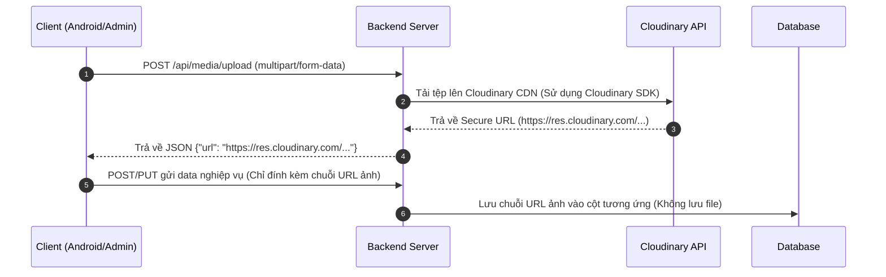

# EzRoom Backend Technical Blueprint (v1.2)

Tài liệu thiết kế kỹ thuật và đặc tả API đồng bộ 100% giữa **Android Client App**, **Admin Web Console** và **Backend Server**. 

---

## 1. Cơ chế Lưu trữ Hình ảnh (Cloudinary Integration)

Hệ thống **không lưu trữ nhị phân hình ảnh** trực tiếp vào cơ sở dữ liệu. Tất cả tài nguyên đa phương tiện (ảnh đại diện, ảnh phòng trọ, ảnh minh chứng tranh chấp, ảnh CCCD eKYC) được lưu trữ tập trung trên **Cloudinary CDN**.

### 1.1 Quy trình tải lên hình ảnh:


---

## 2. Thiết kế Cơ sở Dữ liệu (MongoDB Schemas)

Sử dụng MongoDB làm cơ sở dữ liệu Document. Định dạng ID sử dụng kiểu `String` hoặc ánh xạ `_id` tự động của MongoDB thành thuộc tính `id` khi trả về các APIs để khớp với cách phân tích dữ liệu của cả Android Client và Admin.

### 2.1 Collection `Users`
```json
{
  "_id": "String (User ID)",
  "name": "String",
  "email": "String (Unique)",
  "phone": "String",
  "avatarUrl": "String (Secure Cloudinary URL, Nullable)",
  "role": "String ('RENTER' | 'HOST')",
  "isEkycVerified": "Boolean (Default: false)",
  "creditScore": "Number (Default: 0.0)"
}
```

### 2.2 Collection `Properties`
```json
{
  "_id": "String (Property ID)",
  "name": "String",
  "type": "String ('SINGLE' | 'COMPLEX')",
  "address": "String",
  "detailedAddress": "String",
  "description": "String",
  "commonAmenities": ["String"],
  "latitude": "Number",
  "longitude": "Number",
  "isHidden": "Boolean (Default: false)",
  "hostId": "String (Ref: Users)"
}
```

### 2.3 Collection `Rooms`
```json
{
  "_id": "String (Room ID)",
  "propertyId": "String (Ref: Properties, Nullable)",
  "title": "String",
  "price": "Number (64-bit integer, VNĐ/tháng)",
  "electricityPrice": "Number (Default: 3500)",
  "waterPrice": "Number (Default: 15000)",
  "address": "String",
  "detailedAddress": "String",
  "description": "String",
  "structure": "String ('SINGLE' | 'WHOLE' | 'APARTMENT')",
  "floorArea": "Number",
  "mezzanineArea": "Number (Default: 0.0)",
  "detailedAreas": [
    {
      "id": "String",
      "roomName": "String",
      "areaValue": "Number"
    }
  ],
  "images": [
    {
      "url": "String (Cloudinary URL)",
      "category": "String"
    }
  ],
  "amenities": [
    {
      "name": "String",
      "compensationAmount": "Number"
    }
  ],
  "status": "String ('ACTIVE' | 'RENTED' | 'PENDING' | 'HIDDEN' | 'REMOVED')",
  "latitude": "Number",
  "longitude": "Number",
  "isUserHidden": "Boolean (Default: false)",
  "removalInfo": {
    "reason": "String",
    "dateRemoved": "String"
  }
}
```

### 2.4 Collection `Contracts`
```json
{
  "_id": "String (Contract ID)",
  "roomId": "String (Ref: Rooms)",
  "renterId": "String (Ref: Users)",
  "renterName": "String",
  "renterPhone": "String",
  "hostName": "String",
  "startDate": "String (dd/MM/yyyy)",
  "endDate": "String (dd/MM/yyyy)",
  "depositAmount": "Number",
  "depositStatus": "String ('UNPAID' | 'FROZEN' | 'DISBURSED' | 'REFUNDED')",
  "status": "String ('DRAFT' | 'WAITING_SIGN' | 'WAITING_DEPOSIT' | 'ACTIVE' | 'CANCELLED' | 'TERMINATED' | 'DISPUTED')",
  "dateCreated": "String",
  "dateSigned": "String (Nullable)",
  "cancelReason": "String (Nullable)",
  "cancelBy": "String ('HOST' | 'RENTER', Nullable)",
  "refundInfo": {
    "bankName": "String",
    "accountNumber": "String",
    "accountOwner": "String",
    "status": "String ('PENDING' | 'COMPLETED')"
  },
  "disburseDate": "String (Nullable)",
  "isProtected": "Boolean (Default: false)"
}
```

### 2.5 Collection `Invoices`
```json
{
  "_id": "String (Invoice ID)",
  "roomId": "String (Ref: Rooms)",
  "roomName": "String",
  "period": "String (MM/yyyy)",
  "roomPrice": "Number",
  "oldElectricity": "Number",
  "newElectricity": "Number",
  "oldWater": "Number",
  "newWater": "Number",
  "otherCosts": [
    {
      "reason": "String",
      "amount": "Number"
    }
  ],
  "status": "String ('UNPAID' | 'PAID')",
  "type": "String (Default: 'RENT')",
  "dateCreated": "String",
  "paymentMethod": "String"
}
```

---

## 3. Đặc tả API Endpoints

### 3.1 Media Upload API (Dùng chung cho cả Android & Admin)
*   **POST `/api/media/upload`**
    - *Content-Type:* `multipart/form-data`
    - *Request:* File đa phương tiện đính kèm.
    - *Action:* Tải lên Cloudinary CDN thông qua API/SDK của Cloudinary.
    - *Response:* `{"success": true, "url": "https://res.cloudinary.com/your-cloud-name/image/upload/v12345/room_image.jpg"}`

### 3.2 Client APIs (Dành riêng cho Android App)
*   **POST `/api/auth/register`** (Đăng ký tài khoản)
*   **POST `/api/auth/login`** (Đăng nhập di động)
*   **POST `/api/profile/ekyc`** (Nộp eKYC - tải ảnh CCCD lên Cloudinary rồi gửi API này: `{"idCardNumber": "...", "frontImageUrl": "...", "backImageUrl": "..."}`)
*   **GET `/api/properties`** & **POST `/api/properties`** (Quản lý tòa nhà của Host)
*   **GET `/api/rooms`** (Danh sách phòng hiển thị trên Discovery)
*   **POST `/api/rooms`** (Host tạo/sửa phòng trọ, gửi ảnh dạng URL của Cloudinary)
*   **POST `/api/contracts`** (Host lập hợp đồng mẫu)
*   **POST `/api/contracts/:id/sign`** (Renter ký hợp đồng)
*   **POST `/api/contracts/:id/payment`** (Lấy mã thanh toán VietQR động để chuyển khoản cọc)
*   **POST `/api/invoices`** (Host tạo hóa đơn tháng)
*   **PATCH `/api/invoices/:id/pay`** (Renter thanh toán hóa đơn)

### 3.3 Admin APIs (Dành riêng cho Admin Web Console)
*   **GET `/api/admin/contracts`**
    - *Action:* Lấy toàn bộ danh sách hợp đồng hệ thống.
    - *Response:* Trả về mảng `Contract` kèm đầy đủ trạng thái `depositStatus` (`FROZEN`, `DISBURSED`, `REFUNDED`) và `status`.
*   **GET `/api/admin/disputes`**
    - *Action:* Lấy toàn bộ danh sách khiếu nại tranh chấp (lọc theo loại: `REVIEW_DISPUTE`, `LISTING_DISPUTE`, `CONTRACT_DISPUTE`).
*   **POST `/api/admin/disputes/:id/resolve`** (Admin đưa ra quyết định giải quyết tranh chấp)
    - *Request Body:* `{"status": "APPROVED"|"REJECTED", "resolutionNote": "Lý do chi tiết..."}`
    - *Mô tả nghiệp vụ đối với tranh chấp hợp đồng (`CONTRACT_DISPUTE`):*
      - Nếu `APPROVED` (Hoàn cọc cho Người thuê): Gọi API hoàn tiền ngân hàng, đổi trạng thái hợp đồng thành `TERMINATED`, `depositStatus` thành `REFUNDED`, `refundInfo.status` thành `COMPLETED`.
      - Nếu `REJECTED` (Giải ngân cho Chủ nhà): Giải ngân tiền cọc từ tài khoản Escrow trung gian cho Host, đổi trạng thái hợp đồng thành `ACTIVE` (hoặc xử lý theo thỏa thuận đền bù), đổi `depositStatus` thành `DISBURSED`.
*   **GET `/api/admin/ekyc/pending`** (Danh sách hồ sơ eKYC chờ duyệt)
*   **POST `/api/admin/ekyc/:id/moderate`** (Duyệt/Bác bỏ xác minh eKYC người dùng)
    - *Request Body:* `{"action": "APPROVE"|"REJECT", "note": "..."}`
*   **GET `/api/admin/rooms/moderation`** & **POST `/api/admin/rooms/:id/moderate`** (Kiểm duyệt, ẩn hoặc khóa bài đăng vi phạm)

---

## 4. Quy trình nghiệp vụ đặc thù cho Backend Agent

1.  **Hạch toán Hóa đơn & Thu phí nền tảng:**
    - Khi nhận được tín hiệu thanh toán hóa đơn qua API `PATCH /api/invoices/:id/pay`, backend tính toán số tiền thực tế giải ngân cho Host:
      `finalRevenue = totalAmount - commission` (trong đó `commission = roomPrice * 0.05`).
2.  **Đóng băng cọc (Escrow) tự động:**
    - Giao dịch chuyển tiền cọc thành công sẽ kích hoạt trạng thái `FROZEN`. Số tiền này được giữ an toàn trên tài khoản trung gian của hệ thống.
    - Chạy tác vụ Cron Job hàng ngày quét các hợp đồng có `depositStatus == "FROZEN"`. Vào ngày `startDate` của hợp đồng (nếu trạng thái vẫn hoạt động và không có tranh chấp), tự động chuyển `depositStatus` thành `DISBURSED` và thực hiện giải ngân về ví tài khoản chủ nhà.
